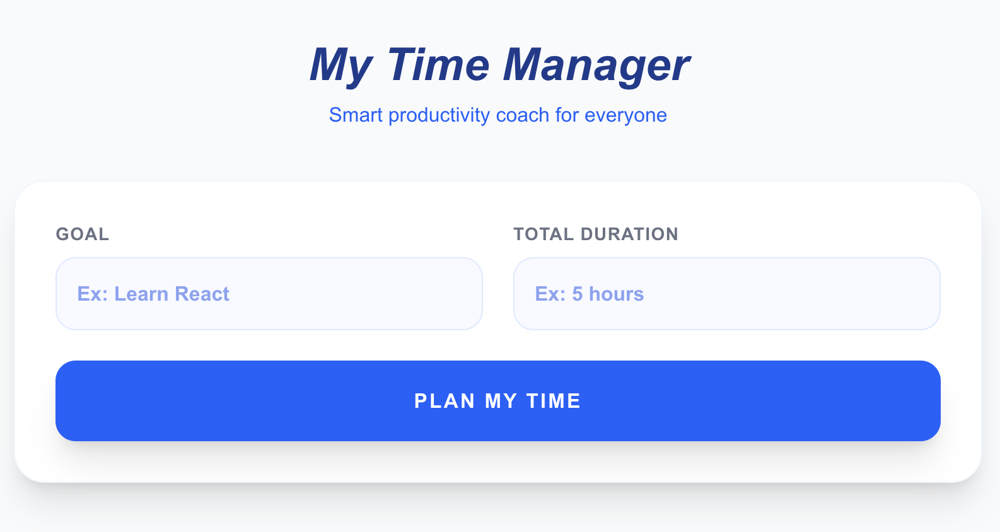

# ⏱️ My Time Manager


**My Time Manager** is a smart productivity tool designed for anyone who struggles estimating the steps and time needed to achieve a set goal. It transforms vague goals into actionable, time-boxed roadmaps using AI-driven logic.

## 🚀 Features
- **AI Roadmap Generation:** Instantly breaks down any goal into 3-6 logical steps.
- **Interactive Progress Tracking:** Real-time progress bar that updates as you complete tasks.
- **Dynamic UX:** Built with React hooks for a seamless, no-reload experience.
- **Mobile First:** Fully responsive design using Tailwind CSS.

## 🛠️ Tech Stack
- **Framework:** Next.js 16 (App Router & Route Handlers)
- **Language:** TypeScript
- **Styling:** Tailwind CSS
- **AI:** OpenAI API

## ⚙️ Setup & Installation

1. **Clone the repository:**
   ```bash
   git clone <git@github.com:itahani/My-Time-Manager.git>
   cd My-Time-Manager

2. **Install dependencies:**
   ```bash
   npm install

4. **Environment Variables:** 
Create a .env.local file in the root directory and add your OpenAI key:
OPENAI_API_KEY=your_api_key_here

5. **Run the development server:**
   ```bash
   npm run dev

Open http://localhost:3000 to see the app.

## 🧠 How it Works  
  
1. **Input:**
   The user provides a goal (e.g., "Learm Python") and a time budget.

3. **AI Processing:**
   The backend sends a structured prompt to the AI, forcing it to return a strict JSON schema with integer-based durations.

5. **Sanitization:**
   The frontend cleans the data to ensure durations are numbers and handles the math for the total time.

7. **Persistence:**
   Every change triggers a synchronization with the browser's localStorage.

## 👀 Future Improvements
- [ ] **AI Task Assistant**: Add a "Help" button on each task to trigger a contextual AI prompt providing specific guidance for that step.
- [ ] **User Experience Customization**: Add a "Skill Level" field to the generator to tailor the complexity of the suggested tasks to the user's expertise.
- [ ] **User Accounts**: Personal Profile to save and manage multiple projects.
- [ ] **Advanced Analytics**: Interactive dashboard to track long-term productivity and completion rates across all projects.
- [ ] **Export to PDF**: Generate a printable version of the plan.
- [ ] **Calendar Sync**: Integration with Google Calendar or iCal.


## Technical Decisions & Challenges
  
1. During development, I encountered API restrictions (Error 403) related to model permissions. To maintain productivity and ensure a working demo, I implemented a Mock System in the backend. This ensures the UI can be tested and demonstrated even without active API credits.

2. Data Integrity: The application enforces a strict JSON contract between the backend and frontend to ensure consistent rendering of steps and sub-tasks.
